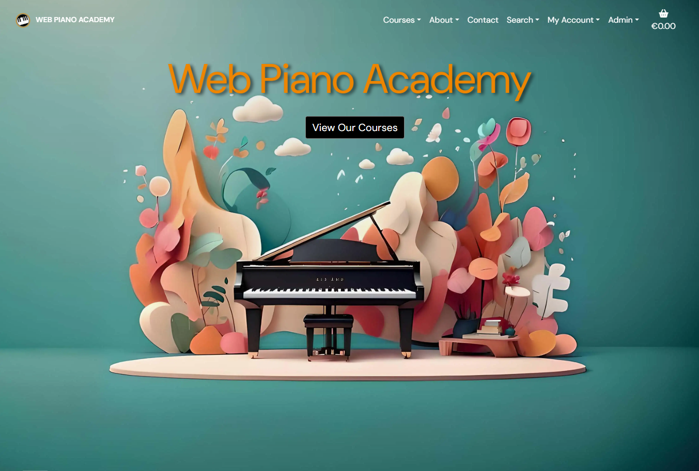
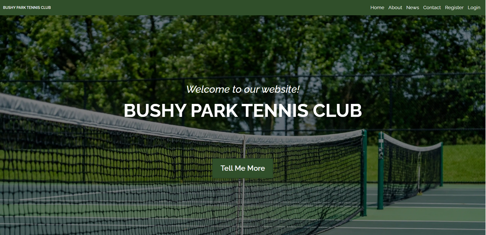
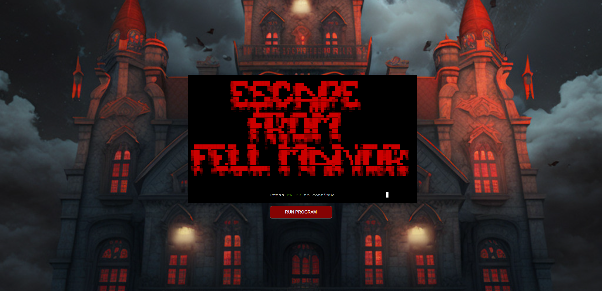
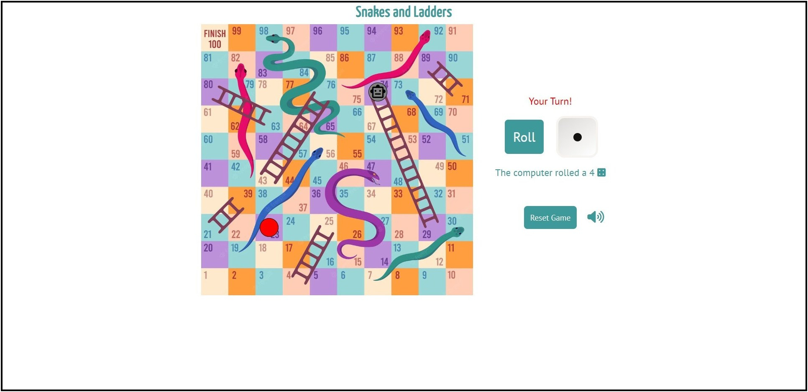

<!--
**LewisMDillon/LewisMDillon** is a ✨ _special_ ✨ repository because its `README.md` (this file) appears on your GitHub profile.

Here are some ideas to get you started:

- 🔭 I’m currently working on ...
- 🌱 I’m currently learning ...
- 👯 I’m looking to collaborate on ...
- 🤔 I’m looking for help with ...
- 💬 Ask me about ...
- 📫 How to reach me: ...
- 😄 Pronouns: ...
- ⚡ Fun fact: ...
-->
 # Lewis Dillon

**`Full-stack sofware development student`**

I'm a full-stack developer in training, always looking to learn and grow. Currently studying at Code Institute in Dublin.
All coding projects are built from the ground up, from planning and designing all the way to solving real-life problems with code. Check out my projects below!
 
Find me on [![LinkedIn][1.1]][1] 

---

### 🧰 Languages and Tools

 

#

### 📊 Stats

|  |  |
| ------------- | ------------- |

## Portfolio Sites

### Web Piano Academy 🎹
<a href="https://github.com/LewisMDillon/web-piano-academy"><a/>
🖼️ Fully fleshed-out e commerce site selling digital piano courses. Users can sign up, and purchase courses using a Stripe payment process secured with Stripe Webhooks. 
 
⚙️ Technologies Used - HTML5, CSS with Bootstrap, JavaScript, Python, Django framework, Postgres DB, Unittest.
      

### Bushy Park Tennis Club 🎾
<a href="https://github.com/LewisMDillon/bushy-park-tennis-club-ld"><a/>
🖼️ Full-stack site for a tennis club. Users can sign up, create custom profiles with profile images, as well as make court reservations using the fully-functioning booking system.
 
⚙️ Technologies Used - HTML5, CSS with Bootstrap, JavaScript, Python, Django framework, Postgres DB, Unittest.
      

### Escape From Fell Manor 🏰
<a href="https://github.com/LewisMDillon/escape-from-fell-manor"><a/>
🖼️ Original retro-style text-adventure game played inside a Python terminal. Player uses text input to navigate through the various game elements. Game includes an inventory & combat system as well as a high-score table.
 
⚙️ Technologies Used - Python, HTML5, CSS, JavaScript.
      

### Snakes and Ladders 🎲
<a href="https://github.com/LewisMDillon/snakes-and-ladders"><a/>
🖼️ Custom-built Javascript version of the board game, ‘Snakes and Ladders’. Users can play against one another in a two-player game, or one player can play against the computer opponent.
 
⚙️ Technologies Used - Javascript, HTML5, CSS

[1]: https://www.linkedin.com/in/lewis-dillon/
[1.1]: https://github.com/LewisMDillon/LewisMDillon/blob/main/static/img/linkedin.png
